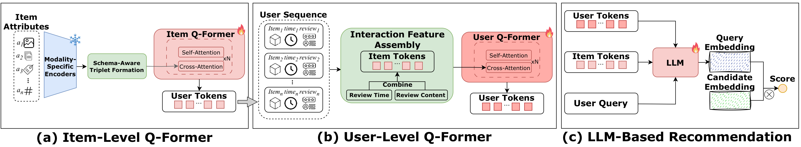

# UniRec: Unified Multimodal Encoding for LLM-Based Recommendations

<p align="center">
    <a href="https://github.com/ulab-uiuc/UniRec">
        
    </a>
    <!-- <a href="http://arxiv.org/abs/2507.10540">
        
    </a> -->
    <a href="https://huggingface.co/datasets/ulab-ai/UniRec">
        
    </a>
    <a href="https://github.com/ulab-uiuc/UniRec/blob/master/LICENSE">
        
    </a>
    <br>
    <a href="https://github.com/ulab-uiuc/UniRec">
        
    </a>
    <a href="https://github.com/ulab-uiuc/UniRec">
        
    </a>
    <a href="https://github.com/ulab-uiuc/UniRec">
        
    </a>
</p>
<p align="center">
    <a href="https://github.com/ulab-uiuc/UniRec">📦 Repository</a> |
    <!-- <a href="http://arxiv.org/abs/2507.10540">📜 arXiv</a> | -->
    <a href="https://huggingface.co/datasets/ulab-ai/UniRec">🤗 Dataset</a> |
    <a href="#-folder-structure">📂 Structure</a> |
    <a href="#-quickstart">🚀 Quickstart</a>
</p>


## Overview

<p align="center">
  
</p>

This repository demonstrates a **nested Q-Former + Qwen3 LoRA** recommendation stack:

1. **Item encoder + Item Q-Former**  
   Raw item fields (text, CLIP features, etc.) → dense field embeddings → **item query tokens**.
2. **User Q-Former**  
   User history as a sequence of item query tokens → **user query tokens**.
3. **Qwen3 + LoRA joint model**  
   Injects item/user query tokens as *special tokens* in Qwen3, then uses the final embedding as a **predicted next-item embedding** for ranking a candidate pool.

All scripts here are copies from the original project, reorganized into a GitHub‑friendly layout (no hardcoded API keys or absolute cluster paths).


## 🛠️ Environment Setup

```bash
conda create -n unirec python=3.9
conda activate unirec

# Core deep learning libraries
pip install torch
pip install transformers
pip install sentence-transformers
pip install peft

# Data processing and utilities
pip install numpy
pip install pandas
pip install scikit-learn
pip install pyyaml
pip install tqdm

# Image processing
pip install Pillow

# HTTP requests (for downloading images)
pip install requests
```

**Note**: This project uses:
- **Qwen3-Embedding-0.6B** for text embeddings (via `sentence-transformers`)
- **CLIP ViT-Large** for image embeddings (via `transformers`)
- **Qwen3-Embedding-0.6B** as the base model for joint training (via `transformers`)
- **PEFT/LoRA** for parameter-efficient fine-tuning

Make sure you have CUDA-compatible PyTorch installed if you plan to use GPU acceleration.


## 📂 Folder Structure

- **`data_processing/`** – build dicts, process recommendation data, generate CLIP embeddings, run Item Q-Former inference, and batch-generate item query tokens.  
  See [`data_processing/README.md`](data_processing/README.md) for details and example flows.

- **`models/`** – core model components (Q-Former backbone + wrappers, item/user encoders, MWNE utilities).  
  See [`models/README.md`](models/README.md) for a breakdown of each module.

- **`training/`** – training scripts for:
  - Item Q-Former,
  - User Q-Former,
  - Joint Qwen3+LoRA with injected query tokens.  
  See [`training/README.md`](training/README.md) for per-script goals and rough pipelines.

- **`evaluation/`** – evaluation scripts (currently: Item Q-Former reconstruction quality).  
  See [`evaluation/README.md`](evaluation/README.md) for usage and metrics.


## 🎯 Data Processing

Run the following commands to prepare your dataset:

### 1. Prepare Data

UniRec is not tied to a single dataset. Because all Amazon Reviews categories share the same schema, the pipeline works on **any** of them — the HuggingFace release is just a ready-to-run **example** so you can start fast, not a required dependency.

- **Fastest start:** download the pre-packaged **Beauty and Personal Care** files from the [UniRec HuggingFace dataset](https://huggingface.co/datasets/ulab-ai/UniRec) (`amazon_beauty/`) and drop them in as shown below. This is the default and needs no configuration.
- **Any other category:** you're free to run on a different Amazon category (Baby Products, Electronics, Books, …). Point the pipeline at it with the `UNIREC_DATASET` environment variable and supply that category's raw files yourself (see *Using a different dataset* below).

The default dataset is the Amazon **Beauty and Personal Care** category. Place the files where the scripts expect them:

```
data_rec/
├── temp/
│   ├── meta_Beauty_and_Personal_Care.jsonl   # item metadata  -> create_item_dict.py
│   └── Beauty_and_Personal_Care.jsonl        # user reviews    -> create_review_dict.py
├── Amazon_Beauty_and_Personal_Care.inter     # interactions    -> process_rec_*.py
├── dict/                                      # generated by the dict builders
├── data/                                      # generated: processed train/test JSON
└── embeddings/                               # generated: CLIP / query-token caches
```

Map the HuggingFace files onto those paths:

| HuggingFace file | Local path |
|---|---|
| `amazon_beauty/raw/meta_Beauty_and_Personal_Care.jsonl` | `data_rec/temp/meta_Beauty_and_Personal_Care.jsonl` |
| `amazon_beauty/raw/Beauty_and_Personal_Care.jsonl` | `data_rec/temp/Beauty_and_Personal_Care.jsonl` |
| `amazon_beauty/recbole/Amazon_Beauty_and_Personal_Care.inter` | `data_rec/Amazon_Beauty_and_Personal_Care.inter` |

Notes on the three raw inputs:

- **`meta_Beauty_and_Personal_Care.jsonl`** – item **metadata** (title, features, price, images, `parent_asin`, …).
- **`Beauty_and_Personal_Care.jsonl`** – user **reviews** (rating, text, `user_id`, `parent_asin`, …). Only needed if you use reviews.
- **`Amazon_Beauty_and_Personal_Care.inter`** – a tab-separated interaction file. The first line is treated as a header and skipped; the loader reads the first four columns as `user_id`, `item_id`, `rating`, `timestamp`.

Only `data_rec/temp/` and `data_rec/Amazon_Beauty_and_Personal_Care.inter` hold raw inputs. The `dict/`, `data/`, and `embeddings/` folders are populated by the scripts below.

> **Using a different dataset.** Every script derives its paths from a single dataset name, defaulting to `Beauty_and_Personal_Care`. To run the whole pipeline on another Amazon category, set the `UNIREC_DATASET` environment variable — e.g. `export UNIREC_DATASET=Baby_Products` — and place that category's files under `data_rec/` with the matching names: `data_rec/temp/meta_<name>.jsonl`, `data_rec/temp/<name>.jsonl`, and `data_rec/Amazon_<name>.inter`.
>
> **Where to get the files for another category:**
> - **Raw metadata + reviews (`.jsonl`)** — download the per-category `meta_<name>.jsonl.gz` and `<name>.jsonl.gz` from the [Amazon Reviews 2023 dataset](https://amazon-reviews-2023.github.io/) (McAuley Lab, UCSD). Its "Grouped by Category" table lists ~30 categories, each with paired `review` and `meta` download links; `gunzip` them into `data_rec/temp/`.
> - **Interactions (`.inter`)** — this repo does not build the `.inter` from raw, so you supply it. It is a RecBole-style atomic file: tab-separated with a header line, columns `user_id`, `item_id`, `rating`, `timestamp`. The review `.jsonl` already contains all four fields (`user_id`, `parent_asin`, `rating`, `timestamp`), so you can generate the `.inter` directly from it, or use [RecBole's conversion tools](https://github.com/RUCAIBox/RecSysDatasets/tree/master/conversion_tools) (see `usage/Amazon.md`) for a standardized RecBole workflow. Note that RecBole's *pre-built* Amazon atomic files are from the 2014/2018 dumps and use different item IDs than Amazon Reviews 2023, so build the `.inter` from the 2023 files to stay consistent with the metadata.
>
> The two Amazon categories in the HuggingFace release (`amazon_beauty/`, `amazon_baby/`) show the exact file layout to reproduce.

Then run the dict builders and rec processors:

```bash
# Build item dictionary (reads data_rec/temp/meta_Beauty_and_Personal_Care.jsonl)
python data_processing/create_item_dict.py

# Build review dictionary (reads data_rec/temp/Beauty_and_Personal_Care.jsonl; only if using reviews)
python data_processing/create_review_dict.py

# Build triplet dictionary
python data_processing/create_triplet_dict.py

# Process recommendation data (reads data_rec/Amazon_Beauty_and_Personal_Care.inter)
python data_processing/process_rec_new_user.py
python data_processing/process_rec_old_user.py
```

You may refer to the specific README in the [`data_processing`](data_processing/README.md) directory for detailed argument descriptions.

### 2. Generate Base Embeddings

Run CLIP embedding generation scripts:

```bash
# Generate CLIP embeddings for items
python data_processing/item_embedding_clip.py

# Generate CLIP embeddings for reviews (if using reviews)
python data_processing/review_embedding_clip.py
```

This will generate CLIP embeddings under `data_rec/embeddings/...`.


## 📊 Training

### Item Q-Former Training

First, optionally precompute field embeddings to speed up training:

```bash
# Precompute and cache all item field embeddings
python training/precompute_full_field_embeddings.py
```

Then train the Item Q-Former:

```bash
# Train Item Q-Former
python training/item_qformer_training.py
```

For more detailed information about the training process, please refer to the specific README in the [`training`](training/README.md) directory.

### Generate Item Query Tokens

After training the Item Q-Former, generate item query tokens for all items:

```bash
# Generate item query tokens cache
python data_processing/generate_all_item_embeddings.py
```

### User Q-Former and Joint Training

Train the User Q-Former and jointly train Qwen3+LoRA:

```bash
# Train User Q-Former
python training/user_qformer_training.py

# Jointly train Qwen3+LoRA with injected query tokens
python training/train_item_individual_token_joint.py
```

You may refer to the specific README in the [`training`](training/README.md) directory for detailed instructions and hyperparameter configurations.


## 📈 Evaluation

UniRec provides evaluation scripts to assess model performance. Currently supported:

- **Item Q-Former reconstruction quality** – measures how well the Item Q-Former reconstructs item field embeddings.

To evaluate your model's performance:

```bash
# Evaluate Item Q-Former reconstruction quality
python evaluation/evaluate_item_qformer.py
```

For detailed information about the evaluation framework, supported metrics, and usage instructions, please refer to the [`evaluation/README.md`](evaluation/README.md).


## 🚀 Quickstart: Typical Pipeline

For a complete end-to-end workflow:

1. **Prepare data**
   - Place raw inputs where the scripts expect them: item metadata at `data_rec/temp/meta_Beauty_and_Personal_Care.jsonl`, reviews at `data_rec/temp/Beauty_and_Personal_Care.jsonl`, and the interaction file at `data_rec/Amazon_Beauty_and_Personal_Care.inter`. (Set `UNIREC_DATASET` to use a different Amazon category.)
   - Run the dict builders and rec processors in `data_processing/`:
     - `create_item_dict.py`, `create_review_dict.py`, `create_triplet_dict.py`.
     - `process_rec_new_user.py` / `process_rec_old_user.py`.

2. **Generate base embeddings**
   - Run `item_embedding_clip.py` (and `review_embedding_clip.py` if you use reviews) to generate CLIP embeddings under `data_rec/embeddings/...`.

3. **Train Item Q-Former**
   - Optionally run `precompute_full_field_embeddings.py` to cache field embeddings.
   - Run `item_qformer_training.py` to train the Item Q-Former and save a checkpoint.

4. **Generate item query tokens**
   - Run `generate_all_item_embeddings.py` to create a cache of item query tokens for all items.

5. **Train User Q-Former and Qwen3+LoRA**
   - Run `user_qformer_training.py` to learn user query tokens from history.
   - Run `train_item_individual_token_joint.py` to jointly train Qwen3+LoRA with injected query tokens.

6. **Evaluate**
   - Run `evaluate_item_qformer.py` to measure Item Q-Former reconstruction quality.

All paths and hyperparameters are **meant to be edited** for your dataset; everything now uses relative paths so the project can be safely pushed to GitHub.


## Citation

If you find this repository useful, please consider citing:

```bibtex
@article{lei2026unirec,
  title={UniRec: Unified Multimodal Encoding for LLM-Based Recommendations},
  author={Lei, Zijie and Feng, Tao and Hua, Zhigang and Xie, Yan and Lin, Guanyu and Yang, Shuang and Liu, Ge and You, Jiaxuan},
  journal={arXiv preprint arXiv:2601.19423},
  year={2026}
}
```
